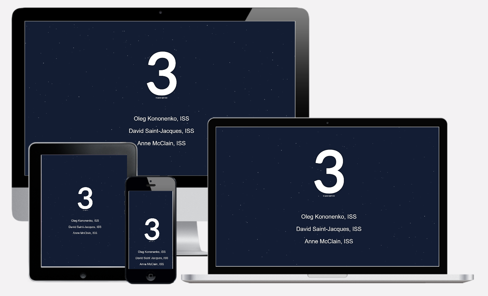

# react-peopleinspace

This is a minimalist single page web application written using Rect.js. Also, this project was bootstrapped with [Create React App](https://github.com/facebook/create-react-app).

Using a unique and interesting API from [Open Notify](http://open-notify.org/Open-Notify-API/People-In-Space/) to fetch data.

## Demo

Heroku: http://react-peopleinspace.herokuapp.com

Private web server: http://peopleinspace.fieel.space/ (you'll have to bypass the "not secure" message, unfortunatelly this API is not secured behind HTTPS but my domain is, unlike heroku)

## Deployment

It's a simple React app so just build the project using the react CLi and then put the index.html file behind a web server, done!